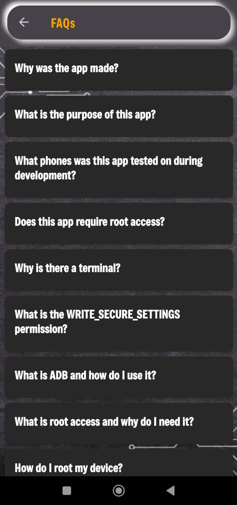
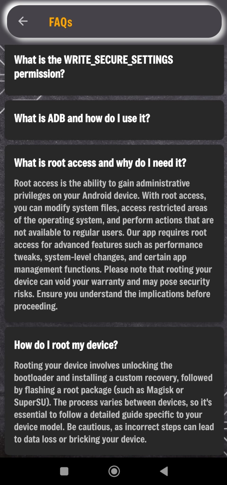

# Device Monitor Android App

## 📌 Description
Device Monitor Android App helps users monitor and manage the performance of their Android devices by providing detailed statistics on CPU, GPU, and memory usage, display settings management, app management, battery optimization, and performance boosting.

---

## 🚀 Features
- **CPU & GPU Monitoring** – Monitor the performance of the processor and graphics processing unit.
- **Battery Management** – Track battery status and optimize power consumption.
- **Performance Booster** – Provides options for GPU acceleration and rendering quality adjustments.
- **Display Options** – Adjust brightness, refresh rate, and resolution.
- **Memory Monitoring** – View detailed memory usage and free up unused memory.
- **Storage Monitoring** – Track storage usage and see breakdown by categories.
- **App Management** – Manage installed apps, uninstall, or disable them.
- **Network Usage Stats** – Monitor network usage and optimize network settings.
- **Debug Terminal** – Run commands and automate tasks through an integrated terminal.

---

## 💻 System Requirements
- Android 6.0 (Marshmallow) or newer  
- Root access for advanced features  
- Magisk for root management (recommended for emulated devices)  

---

## 📥 Installation

### Cloning the Repository
To clone the repository from GitHub, open a terminal and run:

```bash
https://github.com/Ela689/Device_Monitor_Android_App.git
cd DeviceMonitorApp
```
---

## 📂 Opening the Project in Android Studio
1. Open **Android Studio**.  
2. Select **"Open an existing Android Studio project"**.  
3. Navigate to the location where you cloned the repository and select the project folder.  

---

## ⚙ Configuring and Running the Application
1. Make sure you have a physical device or an emulator configured in Android Studio.  
2. If using an emulator, configure it to run **Android API Level 33**.  
3. Click the **Run** button to build and launch the app on the selected device.  

---

## 🔑 Getting Root Access with Magisk

### 📱 On a Physical Device
1. Download and install **Magisk Manager**:  
   - [Magisk GitHub](https://github.com/topjohnwu/Magisk)  
   - [Magisk Setup Guide](https://medium.com/@sarang6489/rooting-android-device-magisk-72e05793a1fb)  

2. Unlock your device bootloader.  
   - This process varies depending on the manufacturer and model.  
   - For Samsung devices, you can find detailed instructions for installing a boot image on their official pages.  

3. Download the **Magisk.zip** file from the official page and copy it to your device.  

4. Boot into recovery mode using your device-specific key combination (e.g., **Volume Down + Power**).  

5. Flash the **Magisk.zip** file using a custom recovery (e.g., TWRP):  
   - [How to Flash TWRP on Samsung Devices](https://support.mobiledit.com/portal/en/kb/articles/how-to-flash-twrp-on-samsung-devices)  

6. Select the file and confirm flashing. Ensure the file is compatible with your device model:  
   - [Find the Correct TWRP for Your Device](https://twrp.me/Devices/#google_vignette)  

7. Once complete, select **Reboot System**.  

8. After the device boots, open **Magisk Manager** and check if root access is active.  

---

### 🖥 On an Emulator
1. Create a new Virtual Device (AVD) in Android Studio with **API Level 33**.  
2. Shut down the emulator if it’s running.  
3. Download the emulator boot image and patch it using Magisk:  
   - Pull the boot image from the emulator:  
     ```bash
     adb pull /path/to/emulator_boot.img
     ```
   - Open **Magisk Manager** on your PC and patch the boot image.  
   - Push the patched boot image back to the emulator:  
     ```bash
     adb push /path/to/patched_boot.img /path/to/emulator
     ```
   - Reboot the emulator with the patched image:  
     ```bash
     adb reboot bootloader
     fastboot boot /path/to/patched_boot.img
     ```
4. Open **Magisk Manager** and ensure root access is active.  

---

## 🔒 Special Permissions
To allow the application to modify secure system settings, run the following ADB command **after** building and running the app:
```bash
adb shell pm grant com.example.devicemonitorapp android.permission.WRITE_SECURE_SETTINGS
```
---
## ℹ About This Permission
This permission allows the app to:  
- Enable/disable developer options  
- Change display configurations  
- Adjust network settings  

⚠ **Warning:**  
This permission is highly restricted because it can affect the overall behavior and security of the device. Use it responsibly and only if you understand the risks.  

---

## ✅ Summary
- Clone the repository and open it in Android Studio.  
- Configure a physical device or emulator (API 33).  
- Root your device/emulator with Magisk for advanced features.  
- Build and run the app in Android Studio.  
- Grant secure system permissions via ADB for full functionality.  
- Enjoy detailed monitoring and performance management for your Android device.  

---

## 📲 App Preview

Below are the main screens and features of the **Device Monitor Android App**:

---

### 🖥 Device Monitor - Home
  
The welcome screen introducing the Device Monitor App.

---

### 📖 Introduction Page
  
Provides a quick introduction and overview of the app.

---

### ❓ FAQs
   
Common questions and answers for quick guidance.

---

### 🌍 Language Selection
  
Option to select the preferred language for the app.

---

### 📊 Management Dashboard
  
  
The central dashboard showing device statistics and monitoring panels.

---

### ⚡ CPU & GPU Monitoring
  
  
Live monitoring of processor and graphics performance.

---

### 🔋 Battery Management
  
Track battery health, charging cycles, and optimization options.

---

### 🚀 Performance Booster
  
Boost device speed and improve performance with one tap.

---

### 🖼 Display Options
  
  
Control brightness, refresh rate, and screen resolution.

---

### 💾 Memory Monitoring
  
  
Detailed statistics about memory usage and cleanup options.

---

### 📦 Storage Monitoring
  
Analyze storage usage and find unnecessary files.

---

### 📱 App Management
  
  
Manage, disable, or uninstall installed apps.

---

### 🌐 Network Usage Stats
  
  
Monitor real-time network usage and optimize connectivity.

---

### 🖥 Debug Terminal
  
An integrated terminal to run commands and automate tasks.

---

